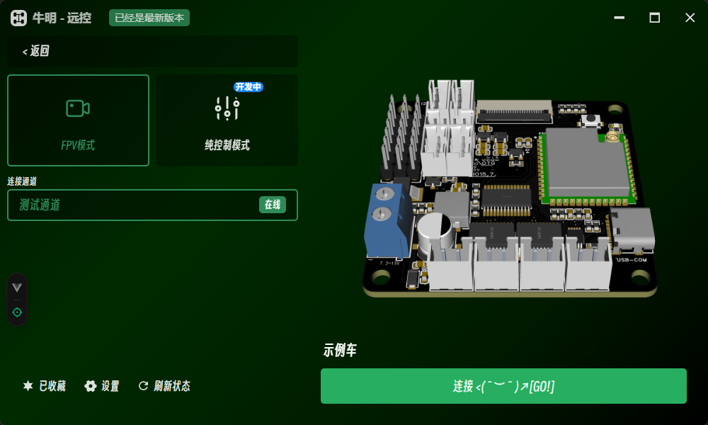

# 这是什么 ?

本项目是一款专为智能遥控小车设计的核心程序、软件，旨在提供开箱即用的硬件平台和可定制的软件生态。其核心使命是打破传统遥控设备的局限，通过深度融合现代嵌入式技术与跨平台交互能力，实现低延迟控制、实时视频传输与无限功能扩展。~~_（好官方...）_~~

他不仅可以用来控制普通的小车，你还可以用它来控制挖掘机、推土机、吊机等等...

## 示例

[//]: # (放一些成品图片)

## 扩展能力

我们支持通过 I2C 接口连接一些PWM输出、继电器、电机驱动、步进电机驱动等类型的扩展板。

[《I2C扩展板》如何使用？](../io/extend)
