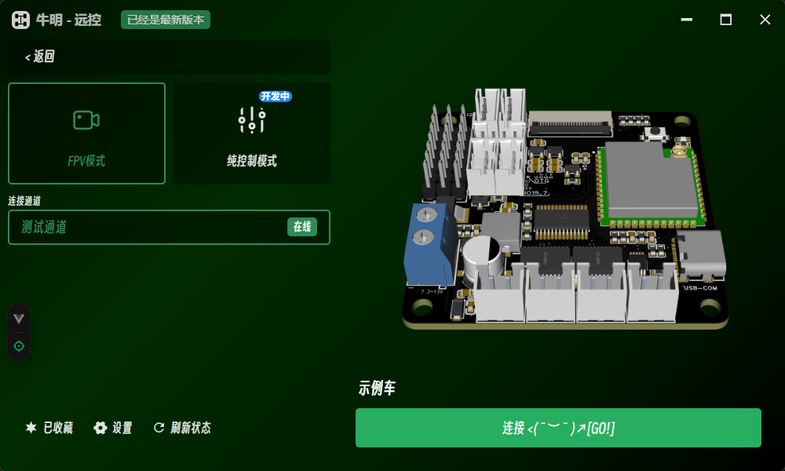

# 这是什么 ?

本项目是一款专为遥控小车设计的核心控制系统（包含硬件与客户端）。我们的初衷是提供一套**开箱即用、高度可定制**的软硬件。

它不仅仅能用来控制一辆普通的四轮小车，你完全可以用它来爆改你的挖掘机、推土机、大吊车、甚至是一个带摄像头的机械臂履带机器人！

---

## 💡 核心亮点

- 💵 **低成本**：使用ESP32S3作为核心，性价比直接拉满。
- 🚀 **低延迟图传**：告别卡顿，第一人称视角（FPV）驾驶体验拉满。
- 🧩 **自由拼装的控制面板**：通过丰富的插件（摇杆、按钮、滑块）定制你的专属遥控器。
- 📱 **跨平台支持**：电脑、安卓手机无缝切换，想用什么设备控制就用什么。

---

## 📸 玩家作品示例

[//]: # (放一些成品图片)

---

## 🔌 强大的扩展能力

觉得主控板上的引脚不够用？完全没关系！

我们支持通过 **I²C 接口** 像“串糖葫芦”一样挂载各种扩展板。无论是增加额外的 PWM 舵机输出、外接大功率继电器，还是连接更多电机驱动、步进电机，统统不在话下！

👉 想知道怎么玩转扩展？请看 [《I²C 扩展板使用指南》](../io/extend.md)
