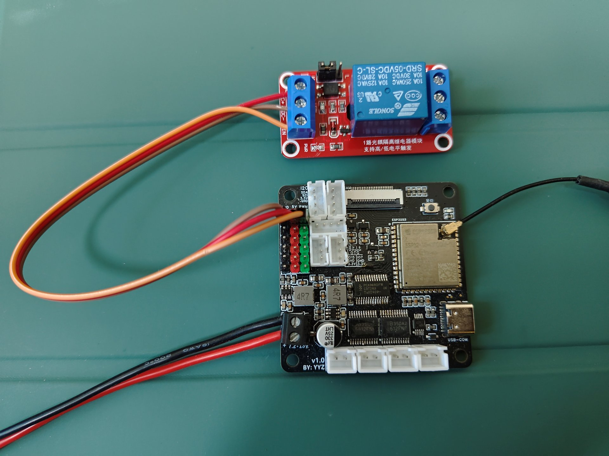
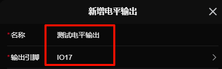
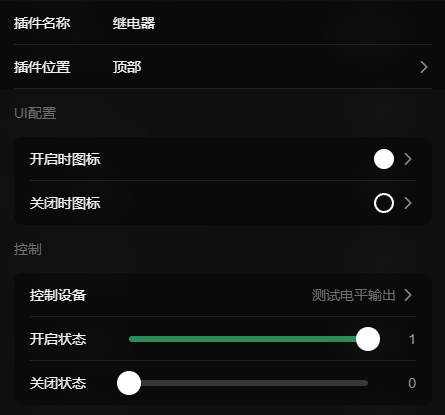

# 电平输出

控制引脚输出高低电平

> **数值范围：0 ~ 1**  
> **id前缀：`o:`**

## 示例

下面使用电平输出来控制一个继电器的吸合来作为示例

### 硬件连接

::: info 提示
在`新增电平输出`的`引脚选择`中能够查看到支持电平输出的引脚
:::

这里将`继电器的控制引脚`连接到支持电平输出的引脚，这里我们连接到`IO17`引脚

### 配置示例

在设置中新增一个**电平输出**，为他起个**名称**，并选择输出引脚为`IO17`

### 示例控制

这里使用`按钮插件`来示例控制他  

1. **添加**或**使用已有**的滑块插件

2. 进入`插件设置`，`控制设备`栏选择我们刚刚新增的电平输出

3. 返回控制页面，找到添加的滑块插件就可以愉快的玩耍啦 ヾ(≧▽≦*)o

<video src="./assets/digital/control.mp4" controls autoplay loop width="450"></video>

::: info 提示
如果需要控制`低电平吸合`的继电器，可将`默认状态`调整为`高电平`，这样默认板子启动时会为高电平
:::

## 配置说明

- **名称*：** 名称
- **输出引脚*：** 需要选择一个支持电平输出的引脚
- **默认状态：** 小车上电时的默认的状态
- **重连时回到默认状态：** 重新连接或断开连接时会回到默认状态