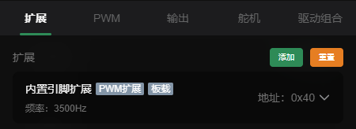
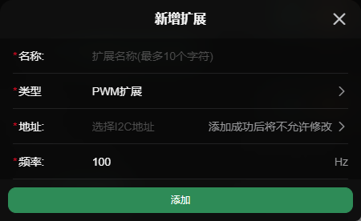
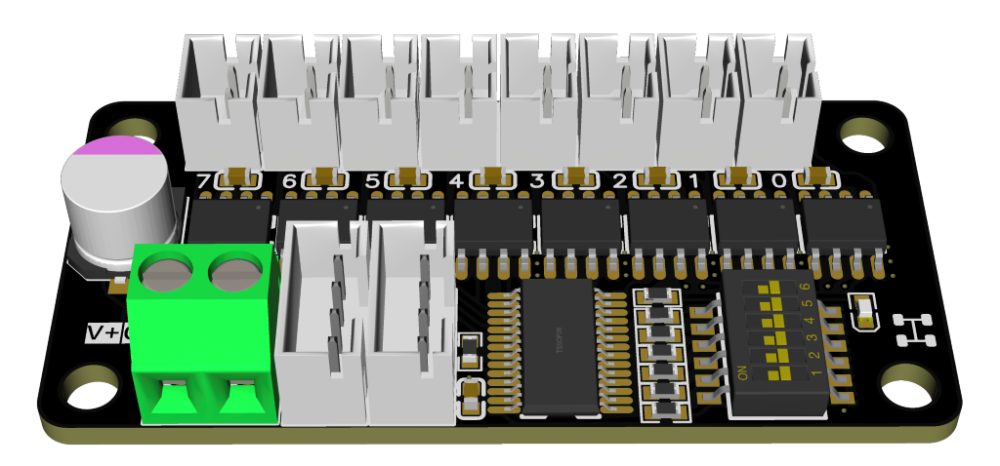
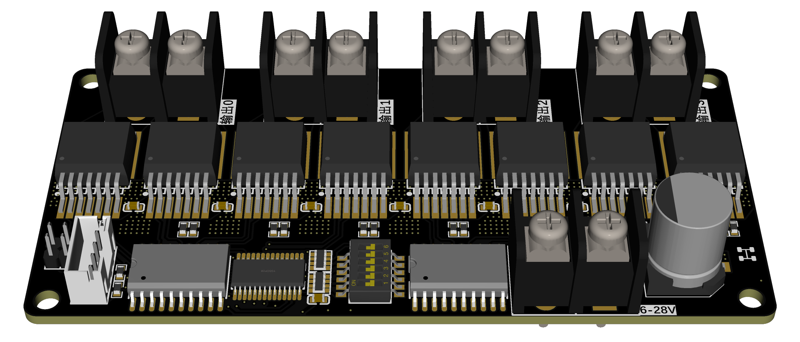

# I2C扩展板

我们支持通过 **I2C** 接口连接一些继电器、电机驱动、步进电机驱动等类型的扩展板。

> 支持两种芯片的扩展板，分别基于PCA9685和PCA9555芯片核心：

**PCA9685芯片**
- **功能**：16通道PWM输出控制
- **用途**：控制舵机、LED、调速等需要PWM的设备

**PCA9555芯片**
- **特点**：16路可配置输入/输出GPIO （暂不支持输入）
- **用途**：扩展数字输入输出引脚，可控制继电器、读取按键状态、控制LED等

## 连接方式

扩展板通过I2C接口与主控板连接，一般需要连接4根线：  
`VCC(3.3V)` `GND` `SDA` `SCL`

## 配置

> 设置 -> 输出设置 -> 扩展

- **名称*：** 名称
- **类型*：** 扩展类型
- **地址*：** I2C地址(需要先连接你的板子，会自动扫描)
- **频率*：** PWM输出的频率(只有部分板子支持)

  

## 一些通用的板子

PCA9685

## 我们开发的板子
下面是我们准备了一些扩展版，他们都可以**一键添加并控制**
### 8路电机驱动

- 8路的电机正反转输出，电源2.5v-12v
- [了解更多](https://doc.bullm.cn/docs/extend-motor/info/start)

### 4路电机驱动-大功率

- 4路的电机正反转输出，电源6v-28v；
- [了解更多](https://doc.bullm.cn/docs/extend-motor-power/info/start)

### 8路继电器

- 8路常开常闭继电器
- 8路可自定义输入或输出电平的io口
- [了解更多](https://doc.bullm.cn/docs/extend-relay/info/start)

