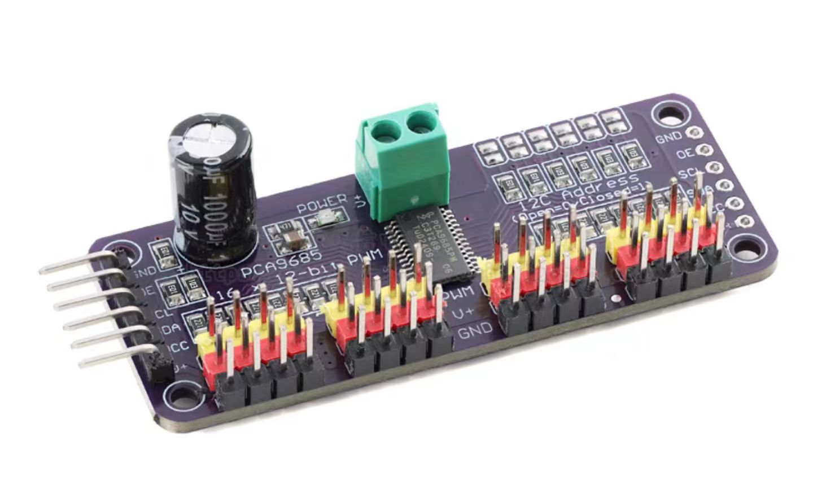
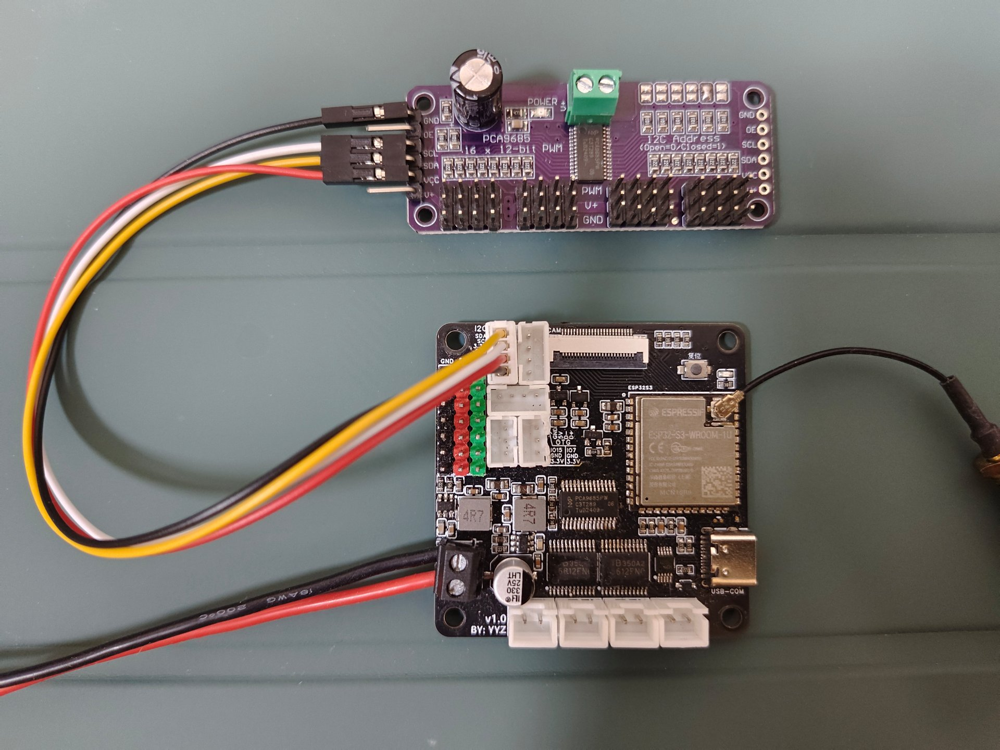
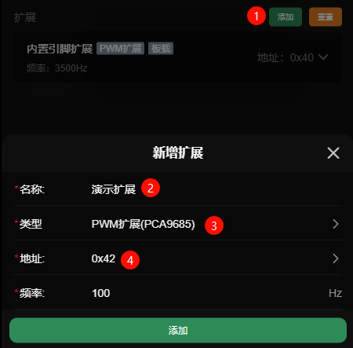
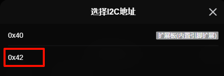
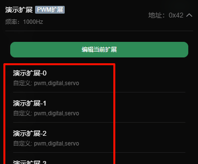
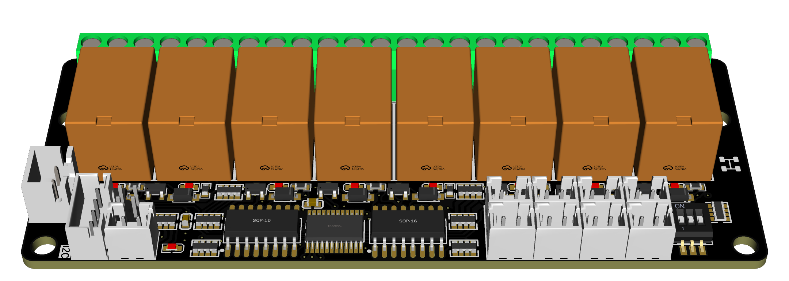

# I2C扩展板

我们支持通过 **I2C** 接口连接一些继电器、电机驱动、步进电机驱动等类型的扩展板。

> 支持两种芯片的扩展板，分别基于PCA9685和PCA9555芯片核心；  
> 后续会支持更多类似，支持自定义扩展，数据透传等；

**PCA9685芯片**
- **功能**：16通道PWM输出控制
- **用途**：控制舵机、LED、调速等需要PWM的设备

**PCA9555芯片**
- **特点**：16路可配置输入/输出GPIO （暂不支持输入）
- **用途**：扩展数字输入输出引脚，可控制继电器、读取按键状态、控制LED等

## 示例

下面将演示连接一个非常常见的PCA9685的扩展板

### 硬件连接

把扩展板和主控的I2C接口连接起来 SCL->SCL;SDA->SDA;GND->GND;VCC->VCC(3.3v或5v)

### 配置示例

- 在设置中点击**添加扩展**，为他起个**名称**，并选择类型为`PWM扩展`

- 点击选择I2C地址，会自动扫描已经连接的I2C地址，如果没有显示，请检查是否连接正常
- 选择对应的扩展板的地址，这个板子的默认地址一般是`0x40`，我这里的地址是`0x42`

- 完成添加后就可以看到该扩展版会生成16个可供自定义使用的引脚
- PCA9685扩展板的引脚支持`电平输出`、`pwm输出`、`舵机控制`

- 接下来你就可以按照[电平输出](./digital)、[PWM输出](./pwm)、[舵机控制](./servo) 章节的方法去使用啦

## 配置

> 设置 -> 基础输出 -> 扩展

- **名称*：** 名称
- **类型*：** 扩展类型
- **地址*：** I2C地址(需要先连接你的板子，会自动扫描)
- **频率*：** PWM输出的频率(只有部分板子支持)

## 我们开发的板子

下面是我们准备了一些扩展版，他们都可以**一键添加并控制**

### 8路电机驱动

- 8路的电机正反转输出，电源2.5v-12v
- [了解更多](https://doc.bullm.cn/docs/extend-motor/info/start)

### 4路电机驱动-大功率

- 4路的电机正反转输出，电源6v-28v；
- [了解更多](https://doc.bullm.cn/docs/extend-motor-power/info/start)

### 8路继电器

- 8路常开常闭继电器
- 8路可自定义输入或输出电平的io口
- [了解更多](https://doc.bullm.cn/docs/extend-relay/info/start)

