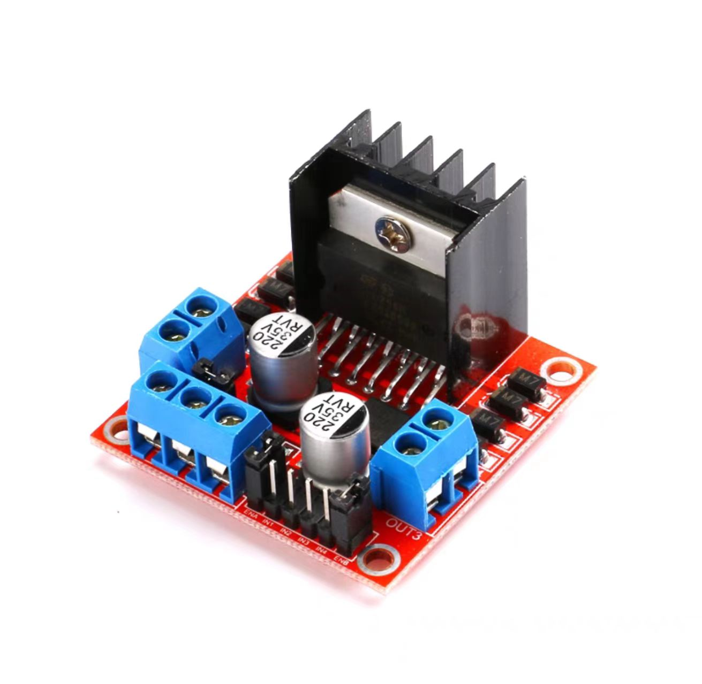
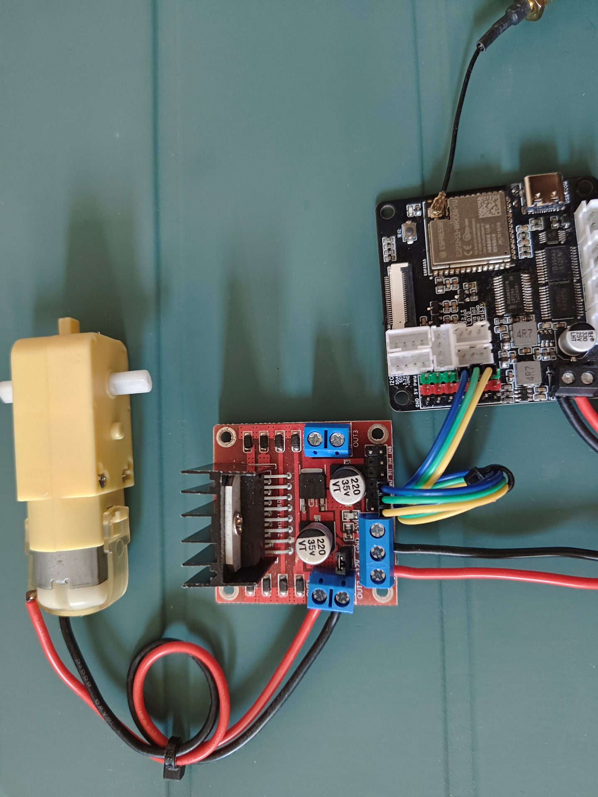
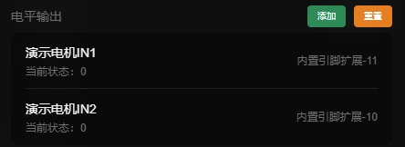
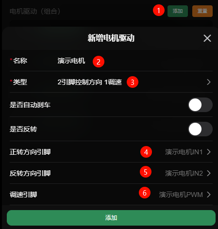

# 电机驱动（组合）

组合依赖pwm和电平输出，会使用一个或多个pwm和电平组合成一个新的设备，主要是用于驱动一些驱动芯片，例：L298N, L9110S，BTS7960B等

> **数值范围：0 ~ 255**  
> **id前缀：`g:`**

## 示例

下面将演示连接一个非常常见的L298N电机驱动，

### 硬件连接

- 把L298N驱动模块和主控连接起来
  - IN1 -> 扩展引脚11; 
  - IN2 -> 扩展引脚10; 
  - EN -> 扩展引脚12;

### 配置示例

1. 控制1路L298N，我们需要先声明 **两个电平输出引脚** 和 **一个PWM输出引脚**  
2. 参考[电平输出](./digital)和[PWM输出](./pwm)

3. 在设置中点击**添加电机驱动**，为他起个**名称**，并选择类型为`2引脚控制方向 1调速`
4. 引脚选择我们刚刚声明的电平输出引脚和PWM输出引脚

5. 成功添加后，就可以使用插件或其他方式去控制这个电机啦 🥰

### 示例控制

这里使用`滑块插件`来控制他

1. **添加**或**使用已有**的滑块插件

2. 进入插件设置，选择添加一个滑块，并选择我们刚刚添加的电机

3. 返回控制页面，找到添加的滑块插件就可以愉快的玩耍啦 ヾ(≧▽≦*)o

<video src="./assets/group/control.mp4" controls autoplay loop width="450"></video>

## 配置

- **名称*：** 名称
- **类型*：** [驱动类型](#类型)
- **是否自动刹车：** 停止时会利用驱动进行电子刹车，部分驱动可能不支持
- **是否反转：** 反转电机
- **引脚...：** 连接驱动的引脚 (pwm和电平) (pwm输出引脚也可作为电平输出引脚使用)

## 类型

### 2PWM和2电平

> 代表驱动：两BTS7960B

这些组合主要是用于控制H桥电路，例如使用两个BTS7960B组成的H桥

| 行为 | EN_A | EN_B | PWM_A | PWM_B |
|----|------|------|-------|-------|
| 正转 | 1    | 1    | PWM   | 0     |
| 反转 | 1    | 1    | 0     | PWM   |
| 刹车 | 1    | 1    | 1     | 1     |
| 停止 | 0    | 0    | 0     | 0     |

### 1PWM和2电平

> 代表驱动：L298N，TB6612FNG

通过1个PWM信号控制电机的转速，2个电平信号控制电机的方向：

| 行为 | A | B | PWM |
|----|---|---|-----|
| 正转 | 1 | 0 | PWM |
| 反转 | 0 | 1 | PWM |
| 刹车 | 1 | 1 | 0   |
| 停止 | 0 | 0 | 0   |

### 2PWM

> 代表驱动：L9110S，DRV8833

通过2个PWM信号控制电机的转速与方向

| 行为 | PWM_A | PWM_B |
|----|-------|-------|
| 正转 | PWM   | 0     |
| 反转 | 0     | PWM   |
| 刹车 | 1     | 1     |
| 停止 | 0     | 0     |

### 1PWM

主要是对PWM进行的映射，详看下面这表格

| 行为 | PWM        | 
|----|------------|
| 正转 | 50% ~ 100% |
| 反转 | 0% ~ 50%   | 
| 停止 | 50%        | 

