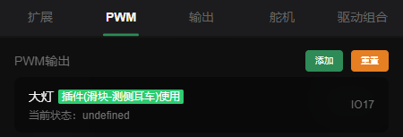
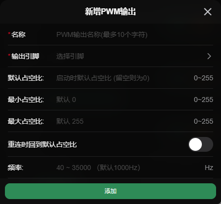

# PWM输出  

> **数值范围：0 ~ 255**  
> **id前缀：`p:`**

## 配置

- **名称*：** 名称
- **输出引脚*：** 需要选择一个支持PWM输出的引脚
- **默认占空比：** 小车上电时的默认占空比
- **最小占空比：** 会限制占空比不小于这个值
- **最大占空比：** 会限制占空比不大于这个值
- **重连时回到默认占空比：** 重新连接或断开连接时会回到默认占空比
- **频率：** PWM的频率，使用扩展版扩展的io不可设置

 

_配置页面_  
  
  
