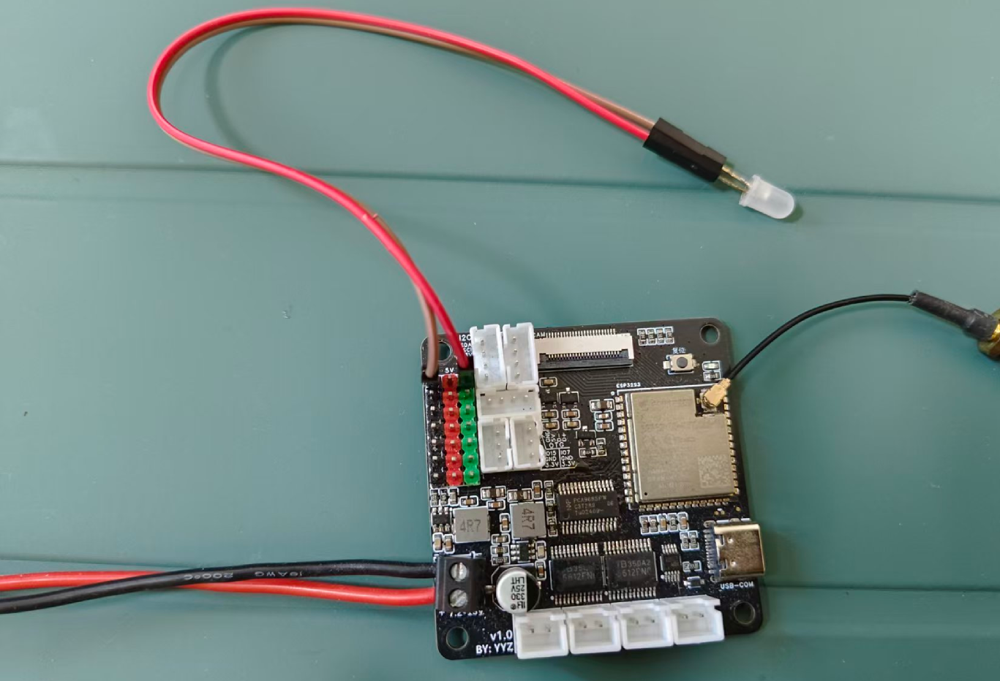
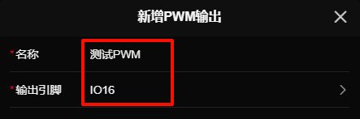
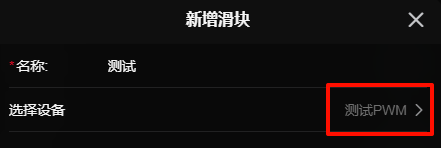

# PWM输出  

> **数值范围：0 ~ 255**  
> **id前缀：`p:`**

## 示例

下面使用pwm控制led亮度，来简单说明pwm输出的使用方法

### 硬件连接

> 在`新增PWM输出`的`引脚选择`中能够查看到支持pwm输出的引脚  

连接一个led到支持pwm输出的引脚，这里我们连接到`IO16`引脚

### 配置

在设置中新增一个**PWM输出**，为他起个**名称**，并选择输出引脚为`IO16`，其他默认即可

### 示例控制

这里使用`滑块插件`来示例控制他

1. **添加**或**使用已有**的滑块插件

2. 进入`插件设置`，选择添加一个滑块

3. `选择设备`栏选择我们刚刚新增的PWM输入

4. 返回控制页面，找到添加的滑块插件就可以愉快的玩耍啦 ヾ(≧▽≦*)o

<video src="./assets/pwm/control.mp4" controls autoplay loop width="450"></video>

## 配置

- **名称*：** 名称
- **输出引脚*：** 需要选择一个支持PWM输出的引脚
- **默认占空比：** 小车上电时的默认占空比
- **最小占空比：** 会限制占空比不小于这个值
- **最大占空比：** 会限制占空比不大于这个值
- **重连时回到默认占空比：** 重新连接或断开连接时会回到默认占空比
- **频率：** PWM的频率，使用扩展版扩展的io不可设置

