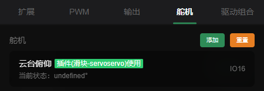
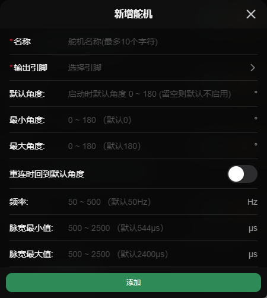

# 舵机控制

> **数值范围：0 ~ 180, 255**  (255为释放舵机)  
> **id前缀：`s:`**

## 配置

- **名称*：** 名称
- **输出引脚*：** 需要选择一个支持舵机输出的引脚或选择选择一个pwm设备
- **默认角度：** 小车上电时的默认角度(留空时会默认释放)
- **最小角度：** 会限制角度不小于这个值
- **最大角度：** 会限制角度不大于这个值
- **重连时回到默认角度：** 重新连接或断开连接时会回到默认角度
- **频率：** 频率，使用扩展版扩展的io不可设置
- **脉宽最小值：** 驱动舵机的脉宽最小值(默认544)
- **脉宽最大值：** 驱动舵机的脉宽最大值(默认2400)

 

_配置页面_  
  
  
