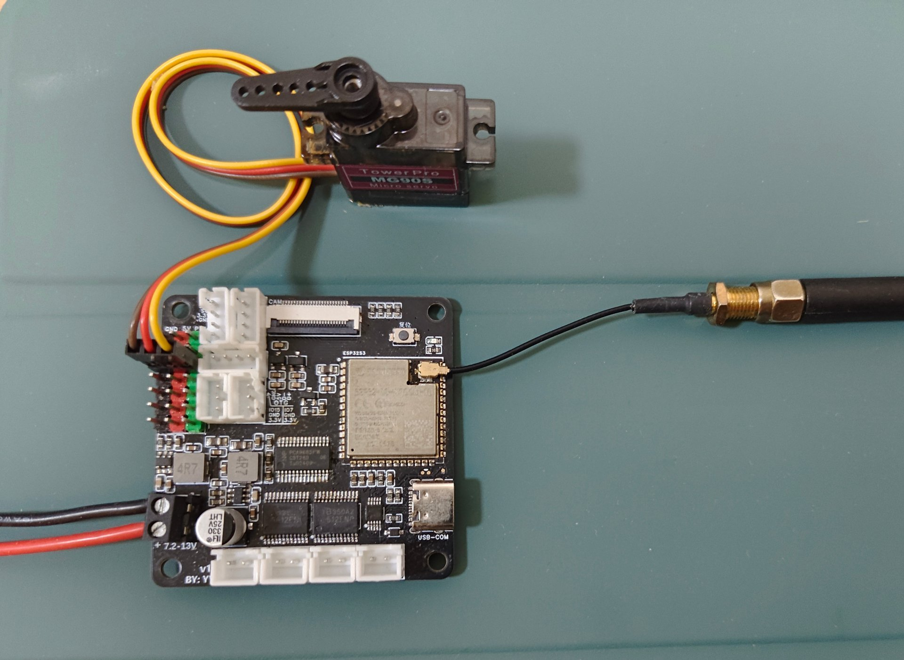
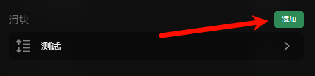
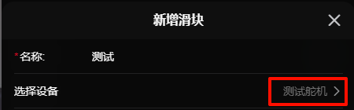

# 舵机控制

控制引脚驱动舵机

> **数值范围：0 ~ 180, 255**  (255为释放舵机)  
> **id前缀：`s:`**

## 示例

下面展示如何控制一个舵机运动

### 硬件连接

::: info 提示
在`新增舵机`的`引脚选择`中能够查看到支持控制舵机的引脚
:::

这里将`舵机的控制引脚`连接到`IO18`引脚

### 配置示例

在设置中新增一个**舵机**，为他起个**名称**，并选择输出引脚为`IO18`

### 示例控制

这里使用`滑块插件`来示例控制他

1. **添加**或**使用已有**的滑块插件

2. 进入`插件设置`，选择添加一个滑块

3. `选择设备`栏选择我们刚刚新增的舵机

4. 返回控制页面，找到添加的滑块插件就可以愉快的玩耍啦 ヾ(≧▽≦*)o

<video src="./assets/servo/control.mp4" controls autoplay loop width="450"></video>

## 配置

- **名称*：** 名称
- **输出引脚*：** 需要选择一个支持舵机输出的引脚或选择选择一个pwm设备
- **默认角度：** 小车上电时的默认角度(留空时会默认释放)
- **最小角度：** 会限制角度不小于这个值
- **最大角度：** 会限制角度不大于这个值
- **重连时回到默认角度：** 重新连接或断开连接时会回到默认角度
- **频率：** 频率，使用扩展版扩展的io不可设置
- **脉宽最小值：** 驱动舵机的脉宽最小值(默认544)
- **脉宽最大值：** 驱动舵机的脉宽最大值(默认2400)

