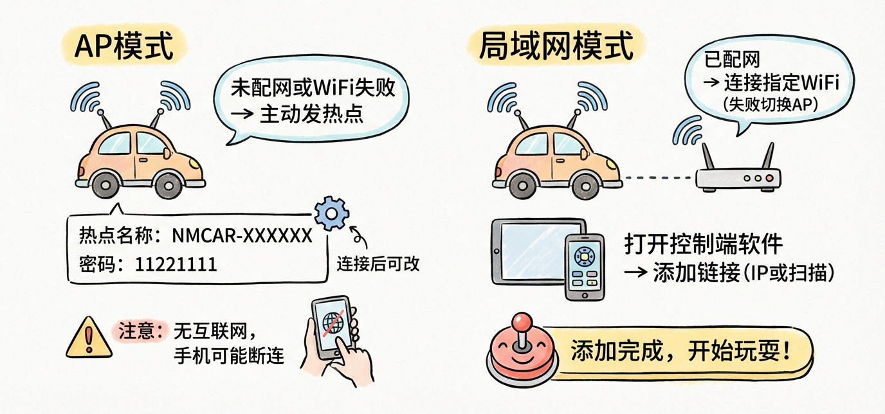

# 连接你的小车 GoGoGo!!!

## AP模式

> 如果你没有给小车配网，或者连接指定的wifi失败了，你的小车将启用AP模式，这个模式下小车会主动发出wifi热点  

热点名称默认为`NMCAR-XXXXXX`，密码为`11221111`。（名称和密码连接后在设置中可修改）

连接到这个热点后打开控制端软件，将会自动扫描AP模式的小车，无需添加

::: warning 注意
小车热点并没有连接的互联网的能，有些手机会主动断开连接
:::

## 局域网模式

> 如果你已经给小车配网，这个模式下小车将会连接指定的wifi，如果连接失败，小车将会切换到AP模式

打开控制端软件，点击添加链接，输入小车的ip，或者使用扫描功能扫描局域网的小车

添加完成即可开始玩耍

::: danger 关于互联网控制
如果你只是简单的将小车进行**内网穿透**，你会发现会有**部分功能不可用**，比如**实时视频**，因为这些功能使用的是UDP
协议，小车需要能直接访问到你的控制端软件所在的网络

> 如果你不需要这些功能，你当然也是可以使用内网穿透的，只需要把小车的80端口映射出去，然后填入对应的映射地址即可

完整的互联网控制方案还在开发中 🚀

[//]: # (完整的互联网控制方案可以查看 [互联网控制&#40;开发中&#41;]&#40;/docs/basic/internet.md&#41; 章节)
:::

