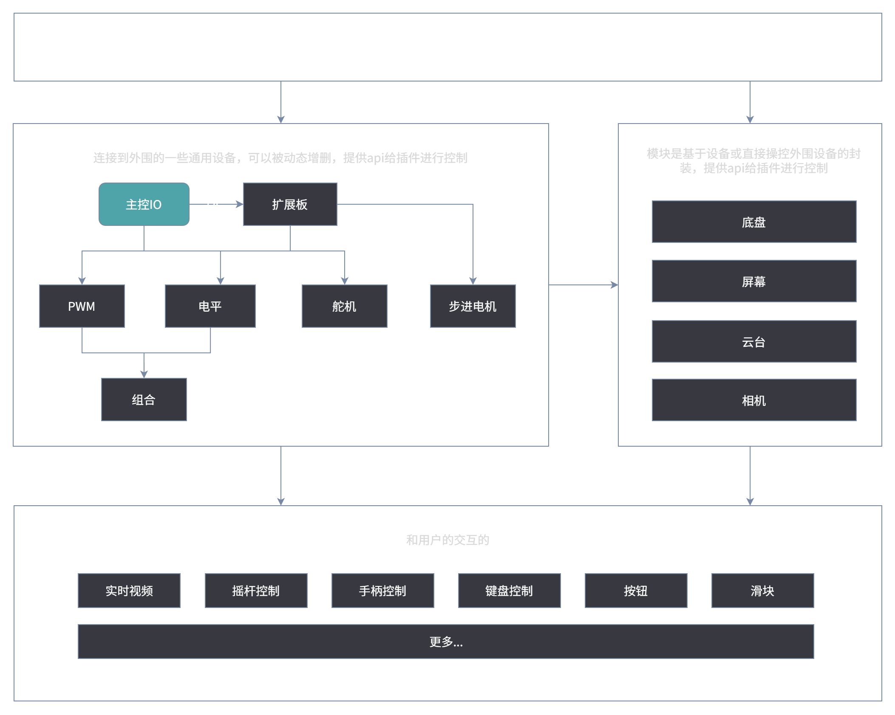

# 系统架构

想要玩转小车，第一步就是了解它是怎么工作的！先来看看我们的系统架构图，这能帮你迅速打通“任督二脉”，让你在后续配置各项功能时不再迷茫。

---

## 为什么要了解架构？

我们的小车系统采用了**分层解耦**的设计理念。听起来可能有点高深，但其实就像搭积木一样简单，它主要分为三个核心层次：

### 1. 硬件底层 (IO 输入输出)
这是系统的“基石”。在这里，你只需要告诉系统：“我有一个电机接在这个引脚上”或者“我有一个舵机连在那里”。**这一层只负责向系统声明硬件的连接状态，并不负责具体的控制交互。**

当你配置好了一个设备（例如将舵机连接到某个引脚上），底层系统会自动将它封装成一个**标准化的控制接口（API）**，供上层调用。

### 2. 模块组合层
这是系统的“大脑中枢”。比如“底盘设置”和“云台设置”。它们的作用是把底层的零散硬件组合起来，赋予它们意义。例如，把四个独立的电机设备组绑定成一个“麦克纳姆轮底盘”，或者把两个舵机组合成一个“两轴云台”。

### 3. 插件交互层 (表层)
这是你最常打交道的地方，也就是系统的“遥控器面板”。各种好玩的插件（如虚拟摇杆、游戏手柄、按钮、滑块等）都运行在这一层。它们通过调用中下层提供的标准化 API，把你手指的滑动和点击，精准翻译成小车实际的物理动作。

---

## 总结

简单来说，配置小车就像是经历这三步：
1. **告诉系统我有什么硬件**（引脚、PWM、舵机、设备组配置）
2. **把硬件组合成有特定功能的模块**（底盘、云台、相机配置）
3. **在界面上添加你喜欢的控制方式**（使用插件）

带着这个思路去阅读后续的文档，你会发现一切操作都是顺理成章的啦！
