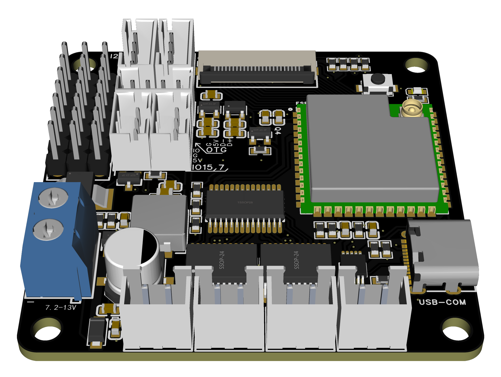

# 让我们开始吧！

## 硬件准备

目前我们准备了一种样式的主控板，我们将其开源至了立创开源硬件平台[https://oshwhub.com/bullm/bullm-remote-main](https://oshwhub.com/bullm/bullm-remote-main)

**主控板:**

<ul style="min-width: 250px">
<li>摄像头接口 × 1</li>
<li>电机驱动接口 × 4 路</li>
<li>PWM 输出 × 4 路</li>
<li>I2C 接口 × 2 个</li>
<li>GPIO 输出 × 7 路</li>
<li>支持 7~13V 电压输入</li>
</ul>

[//]: # (> 如果你不想自己制作，又恰巧财力雄厚，可以前往[https://bullm.taobao.com]&#40;https://bullm.taobao.com/&#41;购买我们制作好主控板  &#40;~~_赚小钱钱_~~&#41;)

### 其他通用硬件

后续我们会适配 **ESP-CAM** 这些通用开发板，方便大家玩耍

## 固件

你可以克隆我们的仓库自行编译，也可以到仓库的`releases`中下载构建好的固件。

- 固件仓库 [bull-m/bullm-remote-esp](https://github.com/bull-m/bullm-remote-esp)

获取到固件后，将对应的固件烧录到你的板子即可

## 客户端

你可以在我们的仓库中直接下载构建好的安装包。

- 客户端仓库 [bull-m/bullm-remote/releases](https://github.com/bull-m/bullm-remote/releases)

目前支持以下平台:

- ✅ Windows
- ✅ Android

即将支持:

- ⏳ Linux
- ⏳ MacOS
- ⏳ IOS

