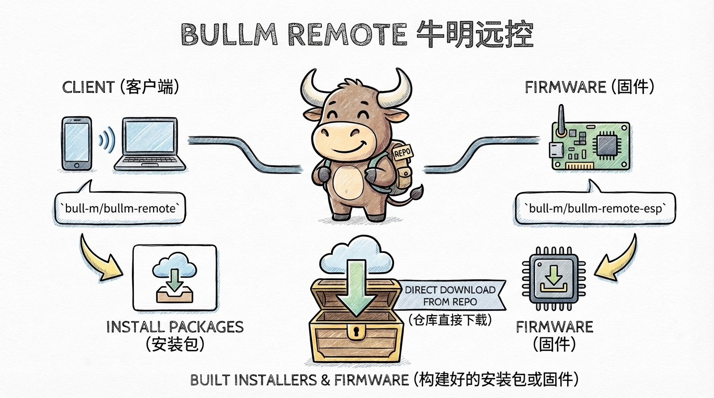

# 让我们开始吧！

## 固件与软件

你可以在我们的仓库中直接下载构建好的安装包或固件。  

- 客户端 [bull-m/bullm-remote](https://github.com/bull-m/bullm-remote)  
- 固件 [bull-m/bullm-remote-esp](https://github.com/bull-m/bullm-remote-esp)

## 主控板

目前我们只有一种样式的主控板，我们将其开源至了[立创开源硬件平台](https://oshwhub.com/bullm)

> 如果你不想自己制作，又恰巧财力雄厚，可以前往[淘宝](https://bullm.taobao.com/)购买我们制作好主控板  (~~_赚小钱钱_~~)
