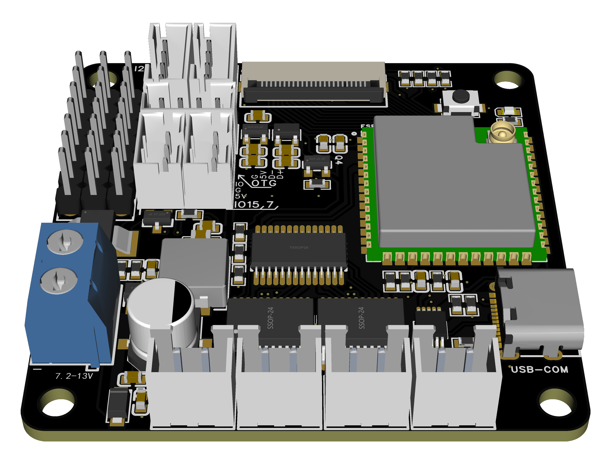

# 让我们开始吧！

欢迎来到 BullM 遥控小车的世界！在正式开始配置之前，我们需要先准备好基础的“装备”。

---

## 🛠️ 1. 硬件准备

为了让大家玩得更爽，我们专门设计了一款专属的开源主控板，并已经将所有工程资料开源到了  
**立创开源硬件平台**：👉 [查看开源主控板详情 (OSHWHub)](https://oshwhub.com/bullm/bullm-remote-main)

**这块主控板到底有多强？**

<ul style="min-width: 250px; line-height: 1.8;">
<li>📷 <strong>摄像头接口</strong> × 1</li>
<li>🏎️ <strong>电机驱动接口</strong> × 4 路</li>
<li>🎛️ <strong>PWM 输出</strong> × 4 路</li>
<li>🔌 <strong>I2C 接口</strong> × 2 个</li>
<li>💡 <strong>GPIO 输出</strong> × 7 路</li>
<li>🔋 <strong>宽电压支持</strong>：7~13V 输入</li>
</ul>

*(小贴士：如果你觉得板子上的接口不够用，或者想直接购买成品，可以前往我们的主站 [牛明工作室 (bullm.cn)](https://bullm.cn/) 看看，比如那里有支持 I²C 控制的 16 路 MOS 驱动模块等扩展硬件哦！)*

### 其他通用硬件支持
如果你手头刚好有 **ESP32-CAM** 这类常见的通用开发板，也不用着急。我们后续会陆续适配这些通用板子，让大家用极低的成本也能快乐玩耍！

---

## 💾 2. 烧录固件

有了硬件，接下来就是给它注入“灵魂”——烧录小车端固件。

你可以选择自己动手丰衣足食（克隆源码自行编译），也可以直接做“伸手党”，到我们的 GitHub 仓库 `releases` 页面下载已经打包好的现成固件。

- 📦 **固件开源仓库**：[bull-m/bullm-remote-esp](https://github.com/bull-m/bullm-remote-esp)

获取到固件后，使用烧录工具把它刷进你的主控板里，小车端就准备就绪啦！

---

## 📱 3. 安装控制端 (客户端)

最后一步，我们需要一个“遥控器”来指挥小车。

你可以在我们的客户端仓库中直接下载对应平台的安装包，安装完毕后就可以连接小车开始配置了！

- 🎮 **客户端下载地址**：[bull-m/bullm-remote/releases](https://github.com/bull-m/bullm-remote/releases)

**目前已完美支持的平台：**
- ✅ Windows
- ✅ Android

**正在疯狂敲代码适配中：**
- ⏳ Linux
- ⏳ MacOS
- ⏳ iOS (苹果用户请再等等我们！)

---

**装备齐全了吗？那我们就进入下一章，正式开始连接和配置你的专属小车吧！**