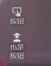
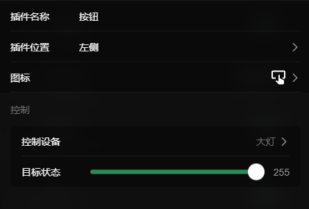

# 按钮 (Button)

想要一键触发某个特定的动作？按钮插件就是为你准备的！只需轻轻一点，就能让小车上的指定设备瞬间到达你预设的状态（例如：一键回正云台、一键亮起车灯、或者一键执行某个复杂的设备组动作）。

## 怎么配置？

按钮的配置非常简单直接，你只需要告诉它“控制谁”以及点击后“变成什么样”。

### 控制设置

点开配置面板，你会看到以下核心选项：

- **控制设备**：选择你想要通过这个按钮控制的底层硬件。支持绑定 PWM 设备、舵机、数字引脚（电平输出）或者一个预先设定好的设备组。
- **目标状态**：当你选中了一个具体的设备后，下方会自动弹出一个滑动条。拖动这个滑动条，就能设置“当按钮被按下时，设备应该到达的具体数值”。

*小贴士：不用担心把目标数值设置得太大或太小导致设备损坏！系统非常聪明，会根据你选择的设备类型，自动读取它的最大值和最小值，并把滑动条限制在安全的范围之内。*
