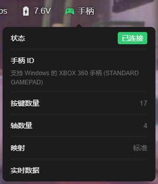
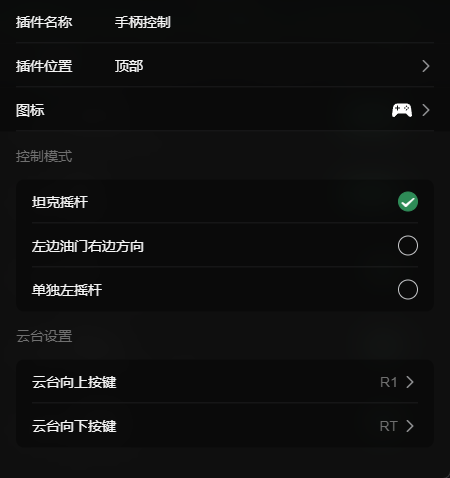

# 游戏手柄 (Gamepad)

游戏手柄插件允许您使用外接的游戏手柄（如 Xbox、PlayStation 或其他兼容的蓝牙/USB 手柄）来控制小车的运动。相比屏幕上的虚拟摇杆，实体手柄能够提供更精确的操控感和真实的物理反馈。此外，您还可以配置手柄上的特定按键来控制云台的运动。

## 配置选项

您可以根据自己的操作习惯或小车的机械结构，在配置面板中自定义手柄摇杆的控制模式，并映射云台的控制按键。

通过配置面板，您可以调整以下设置：

### 控制模式
您可以选择手柄物理摇杆对应的控制逻辑：
- **坦克摇杆**：适合采用差速转向的履带车或四轮车。手柄左摇杆控制左侧履带/轮子，右摇杆控制右侧履带/轮子。
- **左边油门右边方向**：经典的遥控车模式（美国手/日本手变体）。手柄左摇杆负责控制前进后退（油门），右摇杆负责控制左右转向。
- **单独左摇杆**：简化模式。仅使用手柄左摇杆，同时控制前进后退和左右转向（通常为摇杆上下推为前后，左右推为转向）。

### 云台设置
您可以自定义手柄上的按键来控制云台的上下俯仰运动。在配置界面中，按下手柄上对应的按键即可完成映射：
- **云台向上按键**：设置一个按键（例如手柄的十字键上、R1、L1等），按下时云台向上抬起。
- **云台向下按键**：设置一个按键（例如手柄的十字键下、R2、L2等），按下时云台向下低头。
