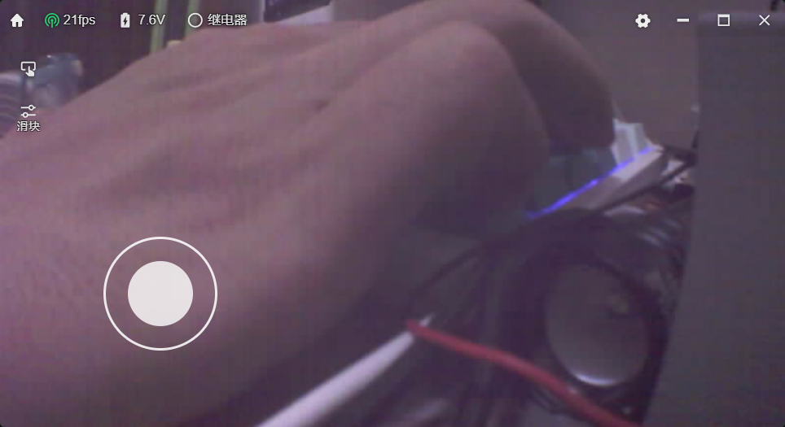
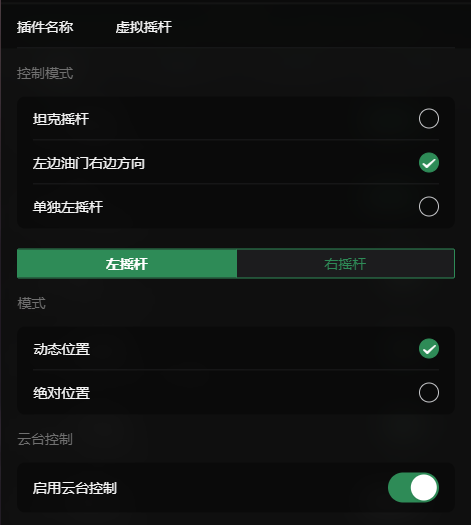

# 虚拟摇杆 (Nipple)

虚拟摇杆插件提供了一个屏幕上的虚拟摇杆界面，主要用于控制小车的运动方向和速度。此外，该插件还支持通过在屏幕上长按并滑动的方式来控制云台的运动。

## 配置选项

您可以根据自己的操作习惯或小车的机械结构，在配置面板中自定义摇杆的控制模式和布局。

通过配置面板，您可以调整以下设置：

### 控制模式
您可以选择适合当前小车类型的摇杆布局模式：
- **坦克摇杆**：适合采用差速转向的履带车或四轮车。左摇杆控制左侧履带/轮子，右摇杆控制右侧履带/轮子。
- **左边油门右边方向**：经典的遥控车模式（美国手/日本手变体）。左摇杆负责控制前进后退（油门），右摇杆负责控制左右转向。
- **单独左摇杆**：简化模式。仅显示一个左摇杆，同时控制前进后退和左右转向。

### 摇杆模式设置
您可以分别为左摇杆和右摇杆设置触摸响应方式：
- **动态位置**：摇杆的中心点不固定。手指在屏幕对应区域（左半屏或右半屏）的任何位置按下时，该位置即成为摇杆的中心点。
- **绝对位置**：摇杆固定在屏幕的特定位置。手指必须准确按在摇杆显示的区域才能进行控制。

### 云台控制
- **启用云台控制**：开启此选项后，允许在屏幕的非摇杆区域通过长按并滑动的操作方式，来控制小车上方云台的上下左右旋转。
